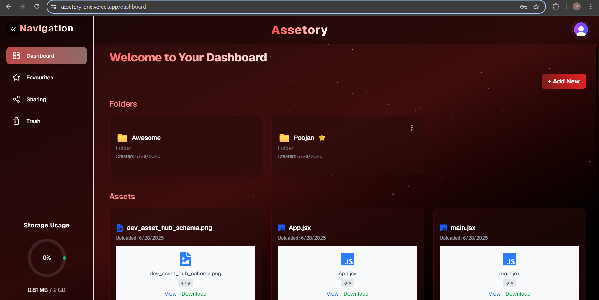
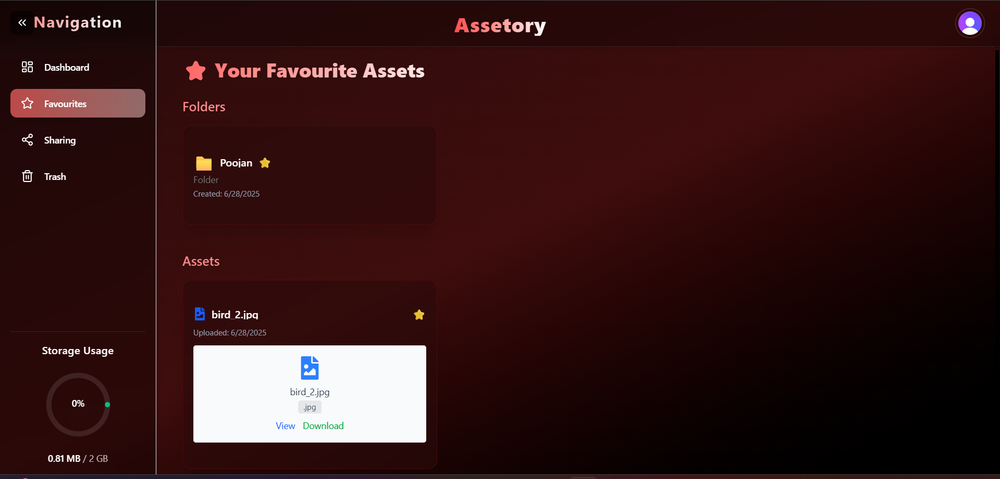
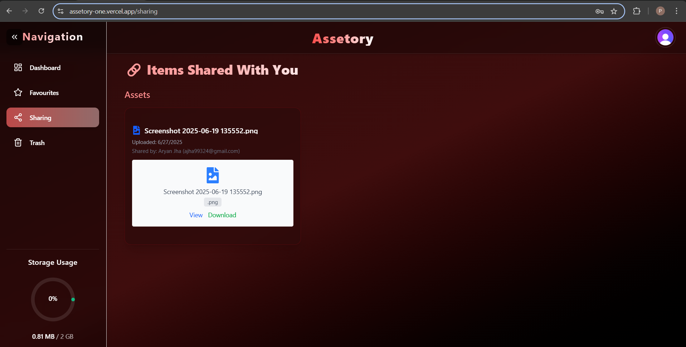
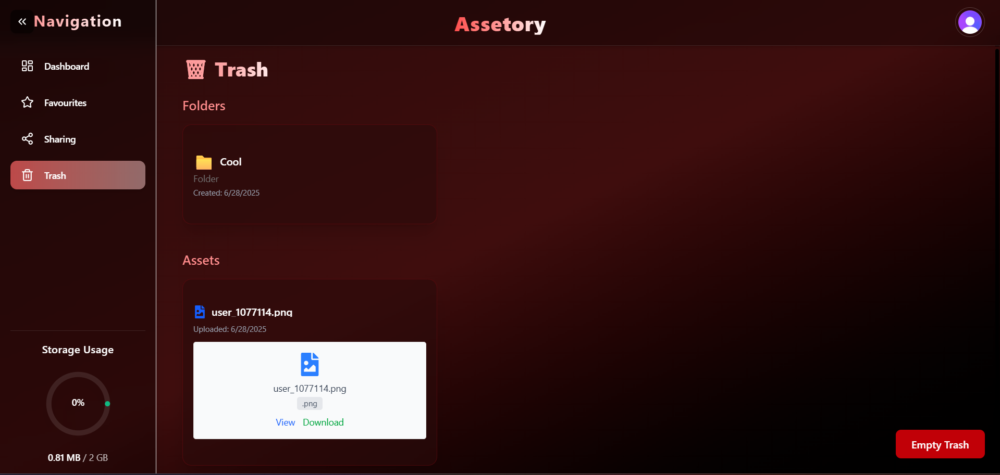

# Assetory

> **A Developer-Centric File & Asset Management Hub**

[🚀 Live Demo](https://assetory-one.vercel.app/)

---

👥 Contributors


Poojan Shrestha — [GitHub](https://github.com/Poojan-Shrestha)

Aryan Jha — [GitHub](https://github.com/CruciFire13)

---

## ✨ Project Overview

**Assetory** is a modern, secure, and developer-friendly digital asset hub designed to make file management seamless for developers and teams. Organize, preview, share, and manage your files, code snippets, images, documents, and more — all from your browser, with robust access controls and blazing-fast performance.

---

## Why Assetory?

- Developer-First Design: Built with developers in mind, supporting code files and technical documentation

- Secure & Private: Enterprise-grade authentication and file security with Clerk

- Collaborative: Share assets with team members via email with granular permissions

- Fast & Reliable: Powered by Next.js 15 and ImageKit CDN for optimal performance

---

## 🗂️ Features

✅ **User Authentication (Clerk)**  
- Sign up / sign in  
- Secure session handling  

✅ **Folder Management**  
- Create nested folders  
- Rename folders  
- Favorite / unfavorite folders  
- Move folders to Trash, restore, or permanently delete  

✅ **Asset Management**  
- Upload diverse file types: images, PDFs, HTML, text, JSON, JS/TS(X), C++, and more  
- Open or download for all file types  
- Rename assets  
- Favorite / unfavorite assets  
- Move assets to Trash, restore, or permanently delete  

✅ **Shared Access**  
- Share assets with other users via email  
- View shared users for each asset  
- Revoke shared access at any time  

✅ **Trash & Recovery**  
- Soft-delete items into a “Trash” area  
- Restore individual items  
- Empty Trash completely (recursively deletes all trashed items)  

✅ **Storage Quota Management**  
- 2 GB storage limit per user  
- 5 MB per-file upload limit  
- Real-time usage display with visual warnings  

✅ **Search & Browse**  
- Browse folders and collections like “Sharing,” “Favorites,” and “Trash”  

---

## 🛠️ Tech Stack

- **Frontend:** Next.js 15, React, Tailwind CSS, Shadcn UI 
- **Backend:** Next.js App Router API Routes  
- **Database:** PostgreSQL (Neon), Drizzle ORM, Drizzle Kit migrations  
- **Authentication:** Clerk  
- **File Storage & CDN:** ImageKit  

---


## 📸 Screenshots



Main dashboard with folder structure and file management



Favourites Page



Sharing Page



Trash Page

---

## ⚙️ Getting Started

### Prerequisites

- Node.js 18+ and npm
- Clerk account
- Neon PostgreSQL database
- ImageKit account
---

## 📦 Installation

Follow these steps to run the project locally:

1. **Clone the repository**

```bash
git clone https://github.com/<YOUR_USERNAME>/assetory.git
cd assetory

```
2. **Install dependencies**

```bash
npm install
```

3. **Create environment variables:**

Create a .env file in the root directory and fill in the following values:
```
NEXT_PUBLIC_CLERK_PUBLISHABLE_KEY=your_clerk_publishable_key
CLERK_SECRET_KEY=your_clerk_secret_key

DATABASE_URL=your_neon_db_url

NEXT_PUBLIC_IMAGEKIT_URL_ENDPOINT=your_imagekit_url_endpoint
IMAGEKIT_PUBLIC_KEY=your_imagekit_public_key
IMAGEKIT_PRIVATE_KEY=your_imagekit_private_key

```

4. **Run the development server**

```bash
npm run dev
```
Visit http://localhost:3000 to see your app running locally.

----

<!-- Set up your services:
Create a Clerk account and get your API keys
Set up a Neon PostgreSQL database and copy your connection string
Register with ImageKit and get your public/private keys -->

🤝 Contributing

Contributions are welcome! To contribute:

1. Fork the project

2. Create a new branch:

```bash
git checkout -b feature/your-feature-name
```

3. Commit your changes:

```bash
git commit -m "Add some feature"
```

4. Push to your branch:

```bash
git push origin feature/your-feature-name
```

5. Open a pull request

---

📄 License
This project is licensed under the MIT License.

📬 Contact
For feedback or questions, reach out via email@example.com or open an issue.

🌐 Links

🔗 Clerk
🔗 NeonDB
🔗 ImageKit
🔗 Next.js

⭐ Star this repository if you found it helpful!
Built with ❤️ by Poojan Shrestha and Aryan Jha
